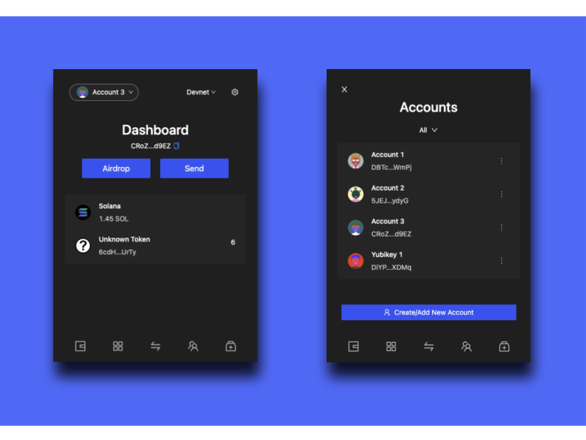
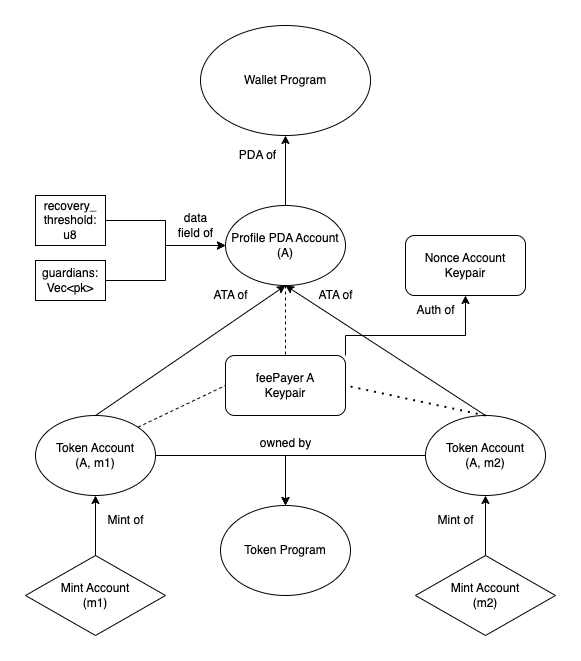

# SolMate

Introducing SolMate, a Solana smart contract wallet with multisig social recovery, eliminating fear of losing your private key and improving usability and security with advanced features



## ✨ Key Features

- Self custody without seed phrases (not good user experience)
- Social recovery with guardians (people, secondary wallet)
- Account locking & freezing
- Setting transaction limit to prevent wallets being emptied
- Multi-factor authentication with authApp
- Ability to interact with arbitrary smart contracts
- Optional whitelist checking

## 🧑‍💻 Getting started

There are no formal blockchain or Web 3 prerequisites for this tutorial, but you should have some experience with [TypeScript](https://www.typescriptlang.org/) and [React](https://reactjs.org/). Having said that, you can certainly complete the tutorial if you at least know basic [JavaScript](https://developer.mozilla.org/en-US/docs/Web/JavaScript). You might just find it more difficult to follow the app's pre-built functionality.

Make sure you have [git](https://git-scm.com/book/en/v2/Getting-Started-Installing-Git), [Node](https://nodejs.org/en/) and [yarn](https://yarnpkg.com/getting-started/install) installed. Then clone the repo and run both the `yarn` and `npm install` command to install the app dependencies. Currently solmate supports node v16 so you need to run `nvm use 16`.

```
git clone https://github.com/kevinxyc1/solmate-extension.git
cd solmate-extension
yarn && npm install && nvm use 16
```

## 💻 Build extension

Build the solmate extension with

```
yarn build
```

You can load unpacked the /frontend/out folder in chrome extension developer mode and use it

## 📈 Flow Diagram


